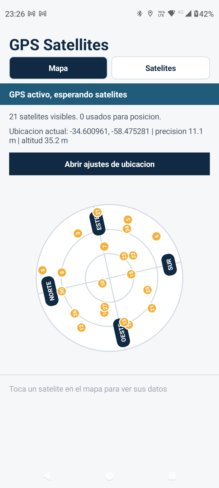
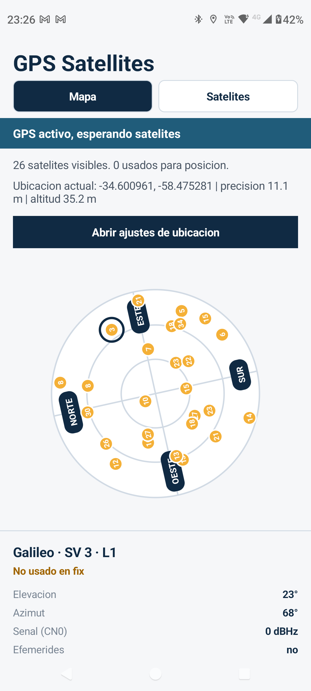

<div align="center">

# 📡 GPS Satellites

**Real-time GNSS sky plot for Android**

[](LICENSE)
[](https://android-arsenal.com/api?level=24)
[](https://www.java.com)
[](https://android.com)

See every GNSS satellite overhead — live, on a compass-aware sky map.

</div>

---

<div align="center">
  
  &nbsp;&nbsp;&nbsp;
  
</div>

---

## Features

| | |
|---|---|
| 🌐 **Multi-constellation** | GPS, GLONASS, Galileo, BeiDou, QZSS, SBAS, IRNSS |
| 🧭 **Compass-aware plot** | Sky map rotates with your phone — North always in front |
| 🟢 **Fix status** | Green = used in fix · Yellow = visible but not used |
| 👆 **Tap to inspect** | Tap any satellite for elevation, azimuth, CN0, ephemeris & almanac |
| 📋 **Satellite list** | Full list with frequency band (L1, L2, L5, E5b) |
| 📍 **Live location** | Coordinates, accuracy and altitude in real time |
| 🔭 **True North** | Magnetic declination correction via `GeomagneticField` |

## Requirements

- Android 7.0+ (API 24)
- Device with GNSS/GPS hardware (all modern smartphones)
- Location permission — **Fine** (required to read satellite data)

## Install

### Download APK
Head to [**Releases**](https://github.com/lpapa1977/gps-satellites/releases) and download the latest `app-debug.apk`.

### Build from source

```bash
git clone https://github.com/lpapa1977/gps-satellites.git
cd gps-satellites
./gradlew assembleDebug
```

The APK will be at `app/build/outputs/apk/debug/app-debug.apk`.

Install directly on a connected device:

```bash
adb install app/build/outputs/apk/debug/app-debug.apk
```

## How it works

### GNSS data

Android's `LocationManager` delivers satellite updates via `GnssStatus.Callback`:

```java
locationManager.registerGnssStatusCallback(new GnssStatus.Callback() {
    @Override
    public void onSatelliteStatusChanged(GnssStatus status) {
        for (int i = 0; i < status.getSatelliteCount(); i++) {
            float azimuth   = status.getAzimuthDegrees(i);
            float elevation = status.getElevationDegrees(i);
            float cn0       = status.getCn0DbHz(i);
            boolean inFix   = status.usedInFix(i);
        }
    }
}, handler);
```

### Sky plot rendering

Each satellite's screen position is computed from elevation and azimuth. The centre is the zenith (90°) and the edge is the horizon (0°):

```java
float distance = radius * (1f - elevation / 90f);
float x = centerX + (float) Math.cos(Math.toRadians(azimuth - 90)) * distance;
float y = centerY + (float) Math.sin(Math.toRadians(azimuth - 90)) * distance;
```

The canvas rotates by the compass heading so the map always matches the sky above you.

### Compass & True North

Heading comes from `TYPE_ROTATION_VECTOR` with exponential smoothing (α = 0.15) and `GeomagneticField` declination for True North correction.

## Project structure

```
app/src/main/java/com/example/gpssatellites/
├── GnssDataStore.java       # Singleton — GNSS state, data & listeners
├── MainActivity.java        # Sky plot canvas + compass integration
└── SatellitesActivity.java  # Scrollable satellite list with band detection
```

## No external dependencies

Zero third-party libraries. Pure Android SDK + Java.

## Contributing

Pull requests are welcome. For major changes, please open an issue first.

## Support

If this app was useful, consider supporting development:

[](https://paypal.me/lpapa1977)

## License

[MIT](LICENSE) © Leonardo Papa
